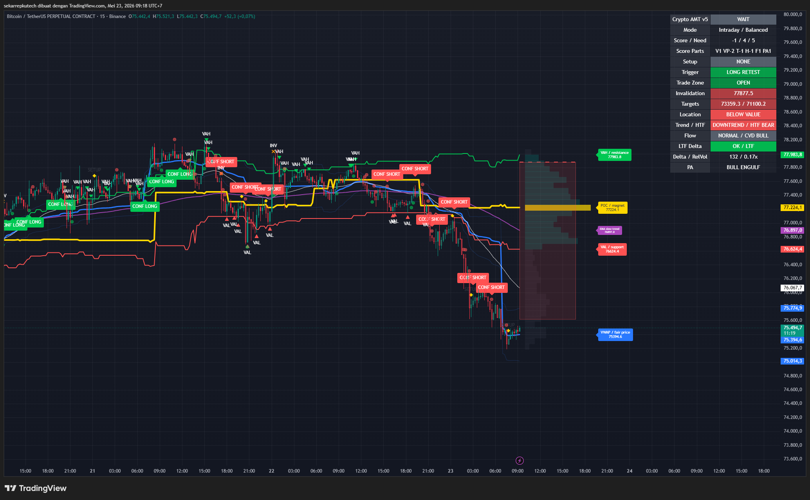
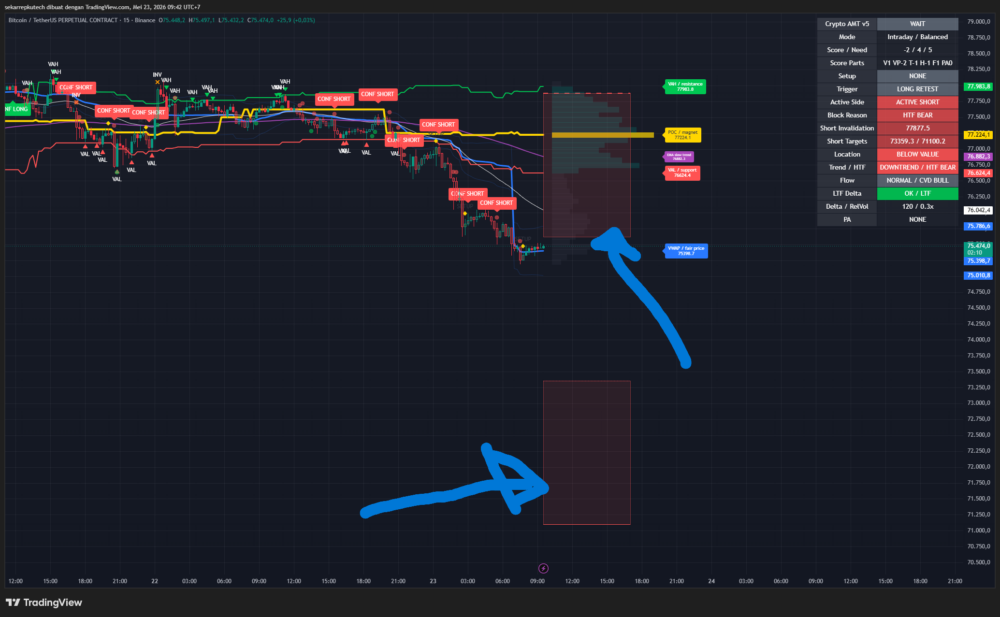

# Panduan Pemula Crypto AMT Toolkit v5

Dokumen ini menjelaskan cara membaca `crypto_amt_toolkit_v5_signal_engine.pine` dengan bahasa yang mudah. Fokusnya bukan membuat kamu langsung entry, tapi membuat kamu paham apa arti tulisan, warna, kotak, dan level di chart.

Penting dulu:

- Ini adalah `indicator(...)`, bukan `strategy(...)`.
- Ini bukan mesin backtest dan bukan robot entry otomatis.
- Ini bukan nasihat finansial.
- Script hanya membantu membaca konteks chart. Keputusan tetap harus kamu validasi sendiri.

## Tujuan v5

V5 dibuat untuk menjawab pertanyaan sederhana:

1. Harga sedang berada di area penting atau tidak?
2. Arah besar market lebih condong naik, turun, atau sideways?
3. Ada tekanan beli/jual dari proxy volume atau tidak?
4. Apakah sinyal baru masih sekadar setup, sudah trigger, atau sudah confirmed?
5. Kalau ada posisi aktif, area risk dan targetnya di mana?

Jadi cara bacanya jangan lihat satu label saja. Baca dari atas ke bawah: konteks dulu, sinyal belakangan.

## Gambar Contoh

Contoh dashboard dan chart v5:



Contoh risk/target helper v5:



Kalau gambar tidak muncul di GitHub lokal, pastikan file gambar masih ada di folder `indicator/docs/image/`.

## Cara Membaca Paling Cepat

Pakai urutan ini:

1. Lihat `Decision` di baris paling atas dashboard.
2. Lihat `Score / Need`.
3. Lihat `Trend / HTF`.
4. Lihat `Location`.
5. Lihat `Active Side`.
6. Lihat `Block Reason`.
7. Baru lihat `Trigger`, `Invalidation`, dan `Targets`.

Kesalahan pemula yang sering terjadi: melihat `Trigger: LONG RETEST` lalu langsung menganggap itu sinyal long. Padahal kalau `Decision` masih `WAIT`, `Setup` masih `NONE`, dan `Block Reason` masih bearish, itu belum valid.

## Dashboard Utama

### Decision

`Decision` adalah kesimpulan utama script saat ini.

Nilai yang bisa muncul:

- `WAIT`: belum ada sinyal yang cukup kuat.
- `WAIT / BLOCKED`: ada sesuatu yang menghalangi sinyal, misalnya market choppy atau volume rendah.
- `SETUP LONG`: kondisi awal long mulai terbentuk, tapi belum confirmed.
- `SETUP SHORT`: kondisi awal short mulai terbentuk, tapi belum confirmed.
- `EARLY WARNING`: ada tanda awal, tapi belum final.
- `CONFIRMED LONG`: sinyal long sudah memenuhi filter script.
- `CONFIRMED SHORT`: sinyal short sudah memenuhi filter script.
- `INVALIDATED`: posisi aktif sebelumnya sudah batal menurut aturan script.

Cara baca mudah:

- `WAIT` berarti jangan maksa baca entry dari trigger kecil.
- `SETUP` berarti baru persiapan.
- `CONFIRMED` berarti sinyal utama muncul.
- `INVALIDATED` berarti skenario aktif sudah rusak.

### Mode

Contoh: `Intraday / Balanced`.

Bagian kiri adalah `Trade mode`:

- `Scalp`: lebih cepat dan lebih permisif.
- `Intraday`: mode tengah, cocok untuk observasi umum.
- `Swing`: lebih ketat, butuh konfirmasi lebih kuat.

Bagian kanan adalah `Performance mode`:

- `Fast`: lebih ringan, beberapa proses dipangkas.
- `Balanced`: mode aman untuk kebanyakan chart.
- `Full`: lebih lengkap, tapi bisa lebih berat.

Kalau chart terasa berat, pakai `Fast` atau kecilkan setting Volume Profile.

### Score / Need

Contoh: `-1 / 4 / 5`.

Artinya:

- angka pertama = score saat ini.
- angka kedua = score minimal untuk setup.
- angka ketiga = score minimal untuk confirmed.

Contoh `-1 / 4 / 5` berarti score sekarang masih negatif. Untuk long, ini belum bagus. Untuk short, score negatif bisa mendukung, tapi tetap harus lihat trigger dan filter lain.

Cara baca cepat:

- Score positif besar: condong long.
- Score negatif besar: condong short.
- Score dekat nol: market belum jelas.

### Score Parts

Contoh: `V1 VP-2 T-1 H-1 F1 PA1`.

Ini pecahan dari score utama.

- `V`: posisi harga terhadap VWAP.
- `VP`: posisi harga terhadap area Volume Profile/value area.
- `T`: trend EMA.
- `H`: HTF bias atau arah timeframe lebih besar.
- `F`: flow, gabungan delta dan CVD.
- `PA`: price action, seperti rejection, engulfing, BOS, impulse.

Nilai positif mendukung long. Nilai negatif mendukung short.

### Setup

`Setup` menjawab: apakah kondisi awal sudah ada?

- `SETUP LONG`: ada struktur awal untuk long.
- `SETUP SHORT`: ada struktur awal untuk short.
- `NONE`: belum ada setup yang layak.

Kalau `Setup` masih `NONE`, jangan terlalu percaya trigger kecil.

### Trigger

`Trigger` adalah kejadian teknis yang baru muncul.

Contoh:

- `LONG RETEST`
- `SHORT RETEST`
- `LONG BREAKOUT`
- `SHORT BREAKDOWN`
- `VAL REJECT`
- `VAH REJECT`
- `BOS UP`
- `BOS DOWN`

Trigger bukan berarti entry final. Trigger hanya bilang: ada kejadian menarik.

Contoh penting:

Kalau dashboard menunjukkan:

- `Decision: WAIT`
- `Setup: NONE`
- `Trigger: LONG RETEST`
- `Trend / HTF: DOWNTREND / HTF BEAR`

Maka artinya: ada pantulan kecil, tapi konteks besar masih bearish. Itu belum confirmed long.

### Active Side

`Active Side` menunjukkan skenario aktif terakhir yang masih dipantau risk helper.

Nilai:

- `ACTIVE LONG`: risk/target yang tampil adalah milik long.
- `ACTIVE SHORT`: risk/target yang tampil adalah milik short.
- `NONE`: tidak ada posisi aktif yang dipantau.

Ini penting untuk memahami kotak risk/target.

Kalau `Active Side: ACTIVE SHORT`, lalu `Trigger: LONG RETEST`, jangan bingung. Artinya posisi aktif yang dipantau masih short, tetapi candle sekarang punya trigger long kecil. Dashboard sudah memisahkan keduanya.

### Block Reason

`Block Reason` menjelaskan kenapa script belum memberi confirmed signal.

Nilai yang sering muncul:

- `HTF BEAR`: timeframe besar bearish, jadi long diblokir atau dilemahkan.
- `HTF BULL`: timeframe besar bullish, jadi short diblokir atau dilemahkan.
- `NEG SCORE`: score belum cukup untuk long.
- `POS SCORE`: score belum cukup untuk short.
- `LOW RELVOL`: volume relatif terlalu kecil.
- `AWAY FROM LEVEL`: harga jauh dari level penting.
- `NO SETUP`: belum ada setup.
- `WAITING TRIGGER`: setup ada, tapi trigger belum ada.
- `OPEN`: tidak ada blokir utama.

Bahasa gampangnya: `Block Reason` adalah alasan kenapa kamu harus sabar.

## Risk dan Target Box

Risk/target helper hanya muncul kalau ada `Active Side`.

### Kalau Active Side = ACTIVE SHORT

Artinya script sedang memantau skenario short aktif.

Dashboard akan menampilkan:

- `Short Invalidation`
- `Short Targets`

Di chart:

- kotak merah = `SHORT RISK`
- kotak teal/hijau kebiruan = `SHORT TARGET`

#### Kalau harga masuk SHORT RISK box

Artinya harga bergerak naik ke area bahaya untuk short.

Cara baca:

- Short mulai tertekan.
- Jangan anggap short masih aman hanya karena target masih ada.
- Perhatikan `Short Invalidation`.

Penting: script menganggap short invalid kalau harga `close` melewati `Short Invalidation`, bukan hanya wick menyentuh area risk.

Jadi:

- wick menyentuh risk box = peringatan.
- candle close lewat invalidation = skenario short invalid menurut script.

#### Kalau harga masuk SHORT TARGET box

Artinya harga turun ke area target short.

Cara baca:

- Area target sudah mulai tercapai secara visual.
- Ini bukan auto take profit.
- Ini bukan bukti profit backtest.
- Ini hanya zona visual untuk membantu membaca reward area.

### Kalau Active Side = ACTIVE LONG

Artinya script sedang memantau skenario long aktif.

Dashboard akan menampilkan:

- `Long Invalidation`
- `Long Targets`

Di chart:

- kotak merah = `LONG RISK`
- kotak teal/hijau kebiruan = `LONG TARGET`

#### Kalau harga masuk LONG RISK box

Artinya harga turun ke area bahaya untuk long.

- Long mulai tertekan.
- Perhatikan `Long Invalidation`.
- Wick menyentuh risk box belum tentu invalid.
- Close melewati invalidation berarti skenario long invalid menurut script.

#### Kalau harga masuk LONG TARGET box

Artinya harga naik ke area target long.

- Target visual mulai tercapai.
- Script tidak otomatis exit.
- Tetap lihat konteks market dan candle terakhir.

## Level Penting di Chart

### VWAP

VWAP adalah area harga rata-rata berbasis volume. Di script ini biasanya diberi label `VWAP / fair price`.

Cara baca simpel:

- Harga di atas VWAP: buyer lebih dominan dalam konteks saat itu.
- Harga di bawah VWAP: seller lebih dominan.
- Harga bolak-balik di sekitar VWAP: market bisa sedang mencari arah.

VWAP bukan garis sakti. Anggap sebagai area fair price.

### POC

POC adalah `Point of Control`, area volume terbesar dalam Volume Profile.

Cara baca:

- POC sering jadi magnet harga.
- Kalau harga jauh dari POC, kadang harga bisa kembali menguji POC.
- Kalau POC ditembus kuat, area value bisa berubah.

Di chart biasanya POC diberi warna kuning.

### VAH

VAH adalah `Value Area High`, batas atas area value.

Cara baca:

- Di bawah VAH: harga masih dalam atau dekat area value.
- Break dan accept di atas VAH: market bisa mulai menerima harga lebih tinggi.
- Rejection di VAH: area atas value menahan harga.

### VAL

VAL adalah `Value Area Low`, batas bawah area value.

Cara baca:

- Di atas VAL: harga masih dalam atau dekat area value.
- Break dan accept di bawah VAL: market bisa menerima harga lebih rendah.
- Rejection di VAL: area bawah value menahan harga.

### EMA Fast dan EMA Slow

EMA membantu baca trend.

- EMA fast di atas EMA slow: trend cenderung naik.
- EMA fast di bawah EMA slow: trend cenderung turun.
- Harga jauh di bawah EMA slow: market cenderung bearish.
- Harga jauh di atas EMA slow: market cenderung bullish.

## Volume Profile

Volume Profile adalah kotak-kotak horizontal di kanan chart.

Cara baca:

- Kotak lebih tebal berarti volume lebih besar di area harga itu.
- Area besar volume sering jadi area penting.
- POC, VAH, dan VAL dihitung dari Volume Profile ini.

Batasan penting:

Volume Profile ini adalah versi custom Pine. Hasilnya tidak harus sama persis dengan built-in TradingView.

## Location

`Location` menunjukkan posisi harga terhadap value area.

Nilai umum:

- `ABOVE VALUE`: harga di atas area value.
- `BELOW VALUE`: harga di bawah area value.
- `IN VALUE`: harga di dalam value area.
- `MIDDLE VALUE`: harga di tengah value area.

Cara baca:

- `ABOVE VALUE`: market sedang mencoba menerima harga tinggi.
- `BELOW VALUE`: market sedang mencoba menerima harga rendah.
- `MIDDLE VALUE`: sering kurang ideal untuk entry karena harga di tengah-tengah.

## Trend / HTF

Contoh: `DOWNTREND / HTF BEAR`.

Bagian kiri = trend timeframe chart sekarang.
Bagian kanan = bias timeframe lebih besar.

Cara baca mudah:

- `UPTREND / HTF BULL`: long lebih mudah didukung konteks.
- `DOWNTREND / HTF BEAR`: short lebih mudah didukung konteks.
- Kalau chart kecil bullish tapi HTF bearish, hati-hati. Bisa cuma pullback.

## Flow, LTF Delta, CVD, dan RelVol

### Flow

`Flow` membaca tekanan volume dari proxy delta.

Nilai umum:

- `BULL DELTA`: tekanan beli kuat.
- `BEAR DELTA`: tekanan jual kuat.
- `NORMAL`: tidak ada tekanan besar.

Ini bukan data bid/ask DOM asli. Ini hanya proxy dari candle dan lower timeframe.

### LTF Delta

`LTF Delta` menunjukkan apakah script memakai data lower timeframe.

Nilai umum:

- `OK / LTF`: lower timeframe delta aktif.
- `OFF / FALLBACK`: LTF dimatikan.
- `FAST FALLBACK / FALLBACK`: performance mode fast, jadi pakai fallback.
- `INVALID > CHART`: timeframe LTF tidak valid untuk chart sekarang.
- `NO INTRABARS / FALLBACK`: data intrabar tidak tersedia.

Kalau status bukan `OK / LTF`, delta masih ada, tapi kualitasnya fallback.

### CVD

CVD adalah akumulasi delta.

Cara baca:

- `CVD BULL`: tekanan beli akumulatif menguat.
- `CVD BEAR`: tekanan jual akumulatif menguat.
- `CVD FLAT`: belum jelas.

CVD bagus untuk konfirmasi, bukan sinyal tunggal.

### RelVol

RelVol adalah relative volume.

Contoh: `0.17x` berarti volume hanya 17% dari rata-rata.

Cara baca:

- Di bawah `1.0x`: volume relatif kecil.
- Di atas `1.0x`: volume mulai aktif.
- Sangat rendah, misalnya `0.17x`, berarti sinyal sering kurang kuat.

Kalau `Block Reason: LOW RELVOL`, artinya script melihat volume belum mendukung.

## Price Action atau PA

`PA` adalah price action sederhana.

Nilai yang bisa muncul:

- `BOS UP`: break of structure ke atas.
- `BOS DOWN`: break of structure ke bawah.
- `BULL ENGULF`: candle bullish engulfing.
- `BEAR ENGULF`: candle bearish engulfing.
- `BULL REJECT`: rejection bullish.
- `BEAR REJECT`: rejection bearish.
- `BULL IMPULSE`: candle bullish kuat.
- `BEAR IMPULSE`: candle bearish kuat.
- `NONE`: tidak ada price action penting.

PA membantu trigger, tapi tetap harus cocok dengan score, trend, dan location.

## Alur Signal Engine

V5 memakai alur ini:

```text
Setup -> Trigger -> Confirmed -> Active Side -> Invalidated
```

### Setup

Setup berarti kondisi awal ada.

Contoh: harga dekat level penting, score mulai cukup, HTF tidak melawan terlalu keras.

### Trigger

Trigger berarti ada kejadian teknis.

Contoh: retest VWAP, rejection VAL, breakdown VAH, BOS.

### Confirmed

Confirmed berarti setup dan trigger lolos filter.

V5 punya alert khusus untuk:

- `Crypto AMT v5 Confirmed Long`
- `Crypto AMT v5 Confirmed Short`

### Active Side

Setelah confirmed, script menyimpan sisi aktif:

- long aktif
- short aktif

Dari situ risk/target helper muncul.

### Invalidated

Invalidated berarti skenario aktif rusak.

Contoh:

- active long lalu close turun lewat long invalidation.
- active short lalu close naik lewat short invalidation.
- muncul confirmed signal lawan arah.

## Alert

V5 punya alert terpisah:

- `Early Warning`: tanda awal, belum final.
- `Confirmed Long`: sinyal long confirmed.
- `Confirmed Short`: sinyal short confirmed.
- `Invalidated`: skenario aktif batal.

Saran pemula:

- Jangan treat `Early Warning` sebagai entry final.
- Lebih penting pantau `Confirmed` dan `Invalidated`.
- Setelah alert muncul, tetap lihat dashboard.

## Clean Mode

`Clean mode` dipakai kalau chart terlalu ramai.

Saat aktif, script menyembunyikan:

- label sinyal historis
- marker VAH/VAL rejection
- flow dots

Yang tetap tampil:

- dashboard
- level tag kanan
- risk/target helper
- VWAP, VP, POC, VAH, VAL jika display-nya aktif

Pakai Clean mode saat kamu ingin fokus ke kondisi sekarang, bukan semua sinyal lama.

## Skenario Umum

### 1. Decision WAIT, Trigger LONG RETEST, Active Side SHORT

Artinya:

- Ada pantulan kecil atau retest long.
- Tapi posisi aktif yang dipantau masih short.
- Kalau `Block Reason` menunjukkan `HTF BEAR` atau `NEG SCORE`, long belum valid.

Cara baca: jangan panik. Itu hanya trigger kecil melawan konteks besar.

### 2. Harga menyentuh SHORT RISK box

Artinya:

- Harga masuk area bahaya untuk short.
- Short belum tentu invalid kalau candle belum close melewati `Short Invalidation`.
- Jika close melewati invalidation, script bisa memberi `INVALIDATED`.

Cara baca: ini warning kuat untuk skenario short aktif.

### 3. Harga menyentuh SHORT TARGET box

Artinya:

- Harga masuk area target short.
- Target visual tercapai.
- Script tidak melakukan exit otomatis.

Cara baca: area reward sudah didatangi, tapi tetap evaluasi manual.

### 4. Decision CONFIRMED LONG tapi HTF masih lemah

Artinya:

- Sinyal long lolos filter script.
- Tapi kalau HTF tidak mendukung, risikonya lebih tinggi.
- Cek `Score Parts`, `Trend / HTF`, dan `RelVol`.

### 5. LTF Delta fallback

Kalau `LTF Delta` tidak `OK / LTF`, berarti delta masih dihitung, tapi bukan dari intrabar ideal.

Cara baca: jangan terlalu percaya flow sebagai bukti kuat. Pakai sebagai tambahan saja.

### 6. RelVol sangat rendah

Kalau `RelVol` kecil, misalnya `0.17x`, market sedang sepi.

Cara baca: breakout atau trigger sering kurang kuat saat volume kecil.

## Checklist Sebelum Percaya Sinyal

Sebelum serius membaca `Confirmed Long` atau `Confirmed Short`, cek ini:

1. Apakah `Score / Need` sudah masuk akal?
2. Apakah `Trend / HTF` mendukung arah sinyal?
3. Apakah harga dekat level penting?
4. Apakah `Block Reason` bukan masalah besar?
5. Apakah `RelVol` cukup hidup?
6. Apakah `LTF Delta` `OK / LTF` atau fallback?
7. Apakah risk box terlalu dekat?
8. Apakah target box realistis?
9. Apakah chart sedang sideways/choppy?
10. Apakah kamu sudah cek timeframe lain?

Kalau banyak jawaban negatif, lebih baik anggap sinyal sebagai observasi, bukan keputusan.

## Yang Jangan Disalahpahami

### Trigger bukan confirmed

`Trigger` hanya kejadian. `Confirmed` baru sinyal utama.

### Target box bukan take profit otomatis

Target box hanya gambar area target. Script tidak keluar posisi.

### Risk box bukan stop loss otomatis

Risk box hanya gambar area bahaya. Script tidak menutup posisi.

### Wick touch bukan selalu invalidation

Yang lebih penting adalah close melewati invalidation.

### Orderflow bukan data DOM asli

Flow, delta, dan CVD di script ini adalah proxy.

### Volume Profile bukan built-in TradingView

VP ini custom dari Pine. Bisa beda dengan built-in TradingView.

## Cara Belajar Paling Aman

1. Pasang v3 dan v5 di chart yang sama.
2. Lihat kapan v5 lebih cepat memberi warning.
3. Lihat kapan v3 lebih bersih.
4. Screenshot contoh yang membingungkan.
5. Catat apa dashboard bilang saat harga bergerak.
6. Jangan ubah terlalu banyak input sekaligus.
7. Test di BTC dan ETH, timeframe 15m dan 1h.

## Ringkasan Super Pendek

- `Decision` = kesimpulan utama.
- `Score / Need` = seberapa kuat confluence.
- `Trend / HTF` = arah besar.
- `Location` = posisi harga terhadap value area.
- `Trigger` = kejadian teknis, bukan entry final.
- `Active Side` = sisi posisi/skenario yang sedang dipantau.
- `Block Reason` = alasan sinyal belum valid.
- Kotak merah = risk/danger zone.
- Kotak teal = target/reward zone.
- `LTF Delta OK / LTF` = data intrabar aktif.
- `RelVol` rendah = sinyal kurang bertenaga.
- `Clean mode` = chart lebih bersih.

Kalau bingung, mulai dari satu aturan: jangan ambil kesimpulan dari satu label. Baca dashboard lengkap dari atas ke bawah.